# 🚀 Globussoft Generative AI Dialer

A full-stack, AI-native Real Estate CRM designed to fully automate telecom sales, field ops geofencing, and internal workflows under the Globussoft architecture.


## 📞 Live AI Call Flow Schematic

```mermaid
sequenceDiagram
    participant CRM as Universal CRM (100+ Providers)
    participant Dialer as FastApi Backend Engine
    participant Human as Target Lead (Human)
    participant STT as Deepgram (Speech-to-Text)
    participant LLM as Gemini 2.5 (AI Brain)
    participant TTS as ElevenLabs (Voice)

    CRM->>Dialer: 1. Background Poller retrieves untested leads
    loop The AI Call Cycle
        Dialer->>Human: 2. Initiates Telecom Call (Twilio/Exotel)
        Human-->>Dialer: 3. Lead picks up the phone
        
        rect rgb(15, 23, 42)
        loop Active Real-Time Conversation Stream
            Human->>Dialer: Speaks (e.g. "I'm looking for a 3BHK")
            Dialer->>STT: Streams raw audio via WebSockets
            STT-->>Dialer: Transcribes speech instantly
            Dialer->>LLM: Ingests transcript & custom Sales Prompt
            LLM-->>Dialer: Generates exact response & qualification state
            Dialer->>TTS: Converts AI text to audio stream
            TTS-->>Dialer: Streams realistic voice bytes
            Dialer->>Human: Plays audio to human speaker seamlessly
        end
        end
    end

    Human->>Dialer: 4. Human hangs up
    Dialer->>LLM: 5. Submits full transcript for final analysis
    LLM-->>Dialer: 6. Returns qualification status & smart follow-up notes
    Dialer->>CRM: 7. Mutates CRM Object (Status to Warm/Closed + Note)
```


## Features Developed

1. **Multilingual AI Voice Agent (Dialer)**
   - Unified Outbound caller supporting both **Twilio** and **Exotel**.
   - Bidirectional real-time `media-stream` webSockets.
   - Powered by Gemini 2.5 LLM context and Deepgram transcription.

2. **Automated Exotel Call Summarizer**
   - Automatically catches completed `.mp3` recordings from Exotel.
   - Transcribes Indian English, Hindi, and Bengali using Deepgram `nova-3`.
   - Summarizes the transcript into distinct *Client Sentiment*, *Budget*, and *Next Steps* using Gemini.
   - Injects the AI Follow-Up Note permanently into the CRM SQLite Database.

3. **Geofenced Field Operations Module**
   - HTML5 `navigator.geolocation` integration for agent site-visits.
   - FastAPI `haversine` formula verifies whether the agent's GPS coordinates are precisely within 500m of a Real Estate Site.
   - Accurate, un-spoofable attendance logging directly attached to the CRM.

4. **Cross-Department Workflow Engine**
   - Automatically monitors CRM Lead stages.
   - Auto-generates Internal Kanban Tickets for `Legal`, `Accounts`, and `Housing Loan` teams when Deals are Closed.
   - Real-time React KPI Reporting.

5. **WhatsApp Automation Triggers (Mocked)**
   - Smart backend engine that fires structural WhatsApp Nudges.
   - For example: Automatically texts Property e-Brochures when an AI categorizes a Lead as "Warm".
   - Viewable via a WhatsApp-Web styled UI within the Dashboard.

6. **CRM Document Vault**
   - Natively attach files and compliance agreements to specific Leads.
   - Distinct SQLite mappings for secure retrieval (`Aadhar`, `PAN`, `Sales Agreements`).
   - Unified Modal UI injected straight into the core CRM.

7. **Visual Data Analytics Center**
   - Natively rendered, dynamic CSS Flexbox charting engine.
   - Visualizes "Call Volume vs. Closed Deals" 7-day trailing trends.
   - Zero-dependency executive monitoring portal for real estate stakeholders.

8. **Global Smart Search Query API**
   - Universal parameter-based SQLite matching engine (`LIKE %...%`).
   - Find Clients by exact Name, substring, or direct Phone Number matches instantly.
   - Beautiful dashboard search-bar state mutation architecture.

9. **Database CSV Export Engine**
   - High-speed Python pipeline converting SQLite arrays into downloadable Dataframes.
   - Streams native `.csv` files via FastApi directly to the Sales Director's local machine.

10. **Role-Based Access Control (RBAC)**
    - Enterprise security UI guardrails hiding sensitive PII and executive data.
    - Simulated `[Admin]` vs `[Agent]` viewer contexts to lock down database export and global metrics routes natively.

11. **Manual Quick Notes System**
    - Instantaneous human-override timeline logging.
    - Allows agents to bypass the LLM Voice agent and directly manually update Client profiles post-call.

12. **GenAI One-Click Email Drafter**
    - Autonomously drafts hyper-personalized Real Estate follow-up emails based on SQLite timeline history.
    - Leverages Gemini 1.5 Flash natively directly inside the React table.

## 🛠 Getting Started

Follow these instructions to set up, run, and test the Generative AI Dialer locally.

### Prerequisites

You will need the following installed on your machine:
- **Node.js** (v16 or higher)
- **Python** (3.9 or higher)
- **Git**

You will also need accounts and API keys for the following services:
- **Twilio** or **Exotel** (For telecom/dialing)
- **Deepgram** (For prompt Speech-to-Text)
- **Google AI Studio / Gemini** (For the core conversation and sales LLM logic)
- **ElevenLabs** (For realistic Voice/TTS)
- **Ngrok** (For localhost tunneling to receive call webhooks)

### 1. Clone the Repository
```bash
git clone <your-repository-url>
cd gbs-ai-dialer
```

### 2. Environment Configuration
Create a `.env` file in the root of the project (the same folder as `main.py`) and populate it exactly as follows with your own credentials:

```ini
# --- TELECOM PROVIDERS ---
# Which dialer to use by default: 'twilio' or 'exotel'
DEFAULT_PROVIDER=twilio

# Twilio Configuration
TWILIO_ACCOUNT_SID=your_twilio_sid
TWILIO_AUTH_TOKEN=your_twilio_auth_token
TWILIO_PHONE_NUMBER=your_twilio_phone_number

# Exotel Configuration (If using Exotel instead of Twilio)
EXOTEL_API_KEY=your_exotel_api_key
EXOTEL_API_TOKEN=your_exotel_api_token
EXOTEL_ACCOUNT_SID=your_exotel_account_sid
EXOTEL_CALLER_ID=your_exotel_caller_id

# --- AI SERVICES ---
DEEPGRAM_API_KEY=your_deepgram_api_key
GEMINI_API_KEY=your_gemini_api_key
ELEVENLABS_API_KEY=your_elevenlabs_api_key
ELEVENLABS_VOICE_ID=your_elevenlabs_voice_id

# --- NETWORKING ---
# This is your Ngrok public URL that Twilio/Exotel will securely ping.
PUBLIC_SERVER_URL=https://your-ngrok-url.ngrok-free.app
```

### 3. Start Ngrok (Webhook Tunneling)
For Twilio or Exotel to reach your local backend during a live call, you must expose your local port `8000` to the public internet securely.
```bash
ngrok http 8000
```
*Copy the `Forwarding` HTTPS URL (e.g., `https://abc-123.ngrok.app`) and paste it into the `PUBLIC_SERVER_URL` variable in your `.env` file.*

### 4. Run the Backend (FastAPI)
Open a terminal in the root directory:
```bash
# Create and activate a virtual environment
python -m venv .venv

# On Windows:
.venv\Scripts\activate
# On Mac/Linux:
# source .venv/bin/activate

# Install dependencies
pip install -r requirements.txt

# Run the server
uvicorn main:app --reload --port 8000
```

### 5. Run the Frontend (React)
Open a new terminal session:
```bash
cd frontend
npm install
npm run dev -- --port 5173
```
Visit `http://localhost:5173` in your browser to view the AI Dialer CRM Dashboard!

### 6. Linking Webhooks (Crucial Step)
Depending on your chosen provider, you must confirm their webhook configurations so the AI can intercept the call.

**If using Twilio:**
You do *not* need to manually configure the webhook endpoint on the Twilio dashboard. The application dynamically builds and passes the webhook (`/webhook/twilio`) during the API call initiation! Just ensure your `PUBLIC_SERVER_URL` inside the `.env` is perfectly accurate and your `TWILIO_PHONE_NUMBER` is verified on Twilio if using a trial account.

**If using Exotel:**
You must configure an Exotel **VoiceBot Applet** in your Exotel call flow visualizer. The applet should point its WebSocket URL to:
`wss://<YOUR-NGROK-URL-WITHOUT-HTTPS>/media-stream`
When the call connects, Exotel will stream the audio down this WebSocket connecting the client perfectly to the AI.
